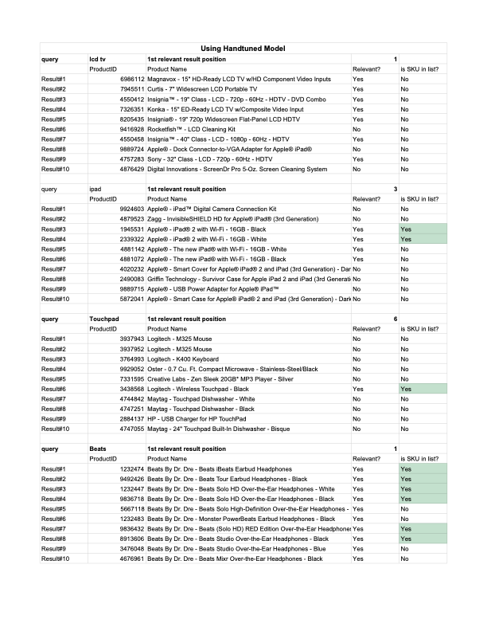

# Search with Machine Learning
The following readme notates the project work and relevant documentation for project submissions. The original README from the forked project is available [here](Original-README.md).

## Week 2
The following are the project assessment questions and responses.

#### Level 1: For classifying product names to categories
The notebook [project2_level1_product_names_classification](week2/project2_level1_product_names_classification.ipynb) has all the steps involved. 

1. **What precision (P@1) were you able to achieve?**  
P@1 = 0.747136013330

2. **What fastText parameters did you use?**  
lr=1.0, epoch=25,wordNgrams=3

3. **How did you transform the product names?**  
Normalization using the provided script which removes all non-alphanumeric characters other than underscore, converts all letters to lowercase and trims excess space characters so that tokens are separated by a single space.

4. **How did you prune infrequent category labels, and how did that affect your precision?**  
Pruned the dataset to have only products whose category labels have atleast 500 products associated with them. Also experimented with having atleast 100 products associated. This improved the precision by atleast 12% 
    
5. **How did you prune the category tree, and how did that affect your precision?**  
   Not attempted        

#### Level 2: For deriving synonyms from content
The notebook [project2_level2_derive_synonyms](week2/project2_level2_derive_synonyms.ipynb) has all the steps involved.
    
1. **What were the results for your best model in the tokens used for evaluation?** 

|     query    |              neighbours               |
|:------------:|:-------------------------------------:|
| headphones   |    ['earbud', 'ear', 'headphone']     |
| laptop       |        ['netbook', 'notebook']        |
| freezer      |  ['freezers', 'refrigerator', 'mug']  |
| nintendo     |      ['ds', 'wii', 'nintendogs']      |
| whirlpool    |  ['frigidaire', 'maytag', 'biscuit']  |
| kodak        |     ['easyshare', 'm763', 'c813']     |
| ps2          |    ['playstation', 'xbox', 'ps3']     |
| razr         |     ['motorola', 'krzr', 'droid']     |
| stratocaster |   ['telecaster', 'strat', 'fender']   |
| holiday      |   ['holidays', 'vibes', 'stocking']   |
| plasma       |       ['600hz', '480hz', '42']        |
| leather      | ['leatherskin', 'armless', 'hipcase'] |

2. **What fastText parameters did you use?**  
model='skipgram',epoch=25, minCount=20

3. **How did you transform the product names?**  
Normalized the product titles using the provided script which converts them to lowercase, removing unusual characters and stemming.

#### Level 3: For integrating synonyms with search
The notebook [project2_level3_integrating_synomyns](week2/project2_level3_integrating_synomyns.ipynb) has all the steps involved.

1. **How did you transform the product names (if different than previously)?**  
Just the regular normalization, nothing additional.

2. **What threshold score did you use?**  
**0.65** was used since the value 0.8 was very restrictive leaving multiple words without synonyms. This might be side effect of the training epochs as with more training, the vectors move closer/away from each other with larger magnitudes pushing the thresholds further.

3. **Were you able to find the additional results by matching synonyms?**
    
    | query     | without synonyms | with synonyms |
    |-----------|------------------|---------------|
    | earbuds   | 1205             | 3572          |
    | nespresso | 8                | 420           |
    | dslr      | 2837             | 10000         |

#### Level 4: For classifying reviews
The notebook [project2_level4_reviews_notebook](week2/project2_level4_reviews_notebook.ipynb) has all the steps involved.

1. **What precision (P@1) were you able to achieve?**  
   P@1 = 0.6839

3. **What fastText parameters did you use?**  
   lr=0.65, epoch=300, wordNgrams=3

4. **How did you transform the review content?**  
   Tokenization and stemming of both the title and comment and then concatenated them together.

5. **What else did you try and learn?**  
   Various tokenization and stemming processes. Utilization of hyperparameters for fasttext. Tried to play with hyper parameter optimizations techniques.
       

## Week 1
The analysis of different experiments using varying weights for main and rescoring queries and with different featuresets is available below.

> **The best MRR score for LTR model is 0.724**

### Hand tuned Model
The relevance judgement for the four test queries for the **hand tuned model** is available below.

### LTR Model
The relevance judgement for the four test queries for the **LTR model** is available below.

### Reproducability steps
1. Ensure that the dataset is loaded in the folder `datasets`
2. Run `./ltr-end-to-end.sh -y -m 0 -c quantiles` to generate and run the test against the model.